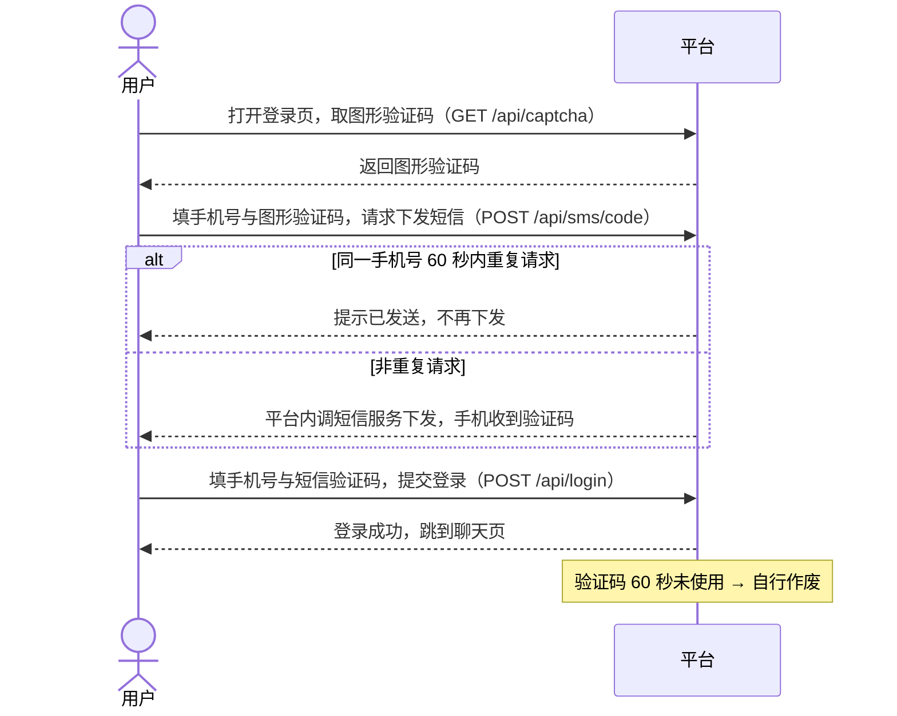

# 01 短信验证码登录

来源：现状，底本为一段代码

触发点：

- 登录页「获取图形验证码」→ GET /api/captcha
- 登录页「发送短信」→ POST /api/sms/code
- 登录页「登录」→ POST /api/login

没登录的人用手机号与短信验证码换到登录态。

```mermaid
sequenceDiagram
    actor U as 用户
    participant P as 平台

    U->>P: 打开登录页，取图形验证码（GET /api/captcha）
    P-->>U: 返回图形验证码
    U->>P: 填手机号与图形验证码，请求下发短信（POST /api/sms/code）
    alt 同一手机号 60 秒内重复请求
        P-->>U: 提示已发送，不再下发
    else 非重复请求
        P-->>U: 平台内调短信服务下发，手机收到验证码
    end
    U->>P: 填手机号与短信验证码，提交登录（POST /api/login）
    P-->>U: 登录成功，跳到聊天页
    Note over P: 验证码 60 秒未使用 → 自行作废
```
